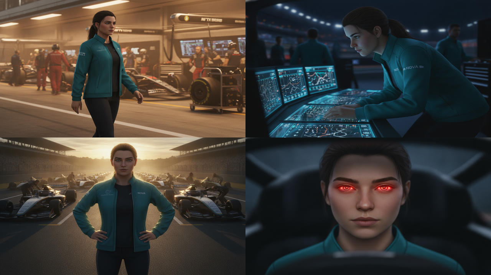

# VibeFrame

Turn a written brief into a rendered MP4 using a coding agent.

VibeFrame is a CLI tool and MCP server for agentic video workflows. It takes a
brief, scaffolds a structured storyboard project, routes generation calls to AI
providers, and produces a reviewed MP4. The CLI is the stable runtime — JSON
output, dry runs, cost gates, and machine-readable reports that Codex, Claude
Code, Cursor, and other host agents can act on.

Your existing coding agent is the outer loop. VibeFrame provides the
video-specific commands and reports. `vibe agent` exists as a fallback when you
do not have another agent available.

[](LICENSE)
[](https://github.com/vericontext/vibeframe/actions/workflows/ci.yml)
[](https://github.com/vericontext/vibeframe/stargazers)

## Directed AI video — one character, many scenes


The four scenes below are the **same character**, directed across a short film
from one brief — **character sheet → image storyboard (one keyframe still per
scene) → Seedance image-to-video → composed render**. Open source, MIT.



▶ **[Watch the full render](https://github.com/vericontext/vibeframe/releases/download/v0.113.4/vibeframe-showcase.mp4)** (1080p, generated end-to-end by `vibe build`).

How it works (run it today):

```bash
# 1. one character sheet, reused everywhere (frontmatter: characters: { nova: "..." })
# 2. per beat: a keyframe still (image storyboard) + the motion prompt
#      keyframe: "NOVA on the starting grid, low-angle hero shot, golden light"
#      video:    "slow push-in as she looks up"
# 3. review the image storyboard cheaply, then animate only what you approve:
vibe build my-film --skip-video        # generate the keyframe stills (cheap), review them
vibe build my-film --max-cost 12       # animate the approved stills (Seedance image-to-video)
```

Prompt craft for both models is in the
[AI video prompting playbook](docs/ai-video-prompting.md); the storyboard cues
(`characters:`, `keyframe:`) are documented in [docs/projects.md](docs/projects.md).

## Requirements

- Node.js 20+
- FFmpeg
- Chrome or Chromium (for HTML scene rendering)
- API keys only for the providers you use (BYO-key)

Free/local paths are available for many editing tasks and for Kokoro TTS. AI
image and video generation requires provider keys such as `OPENAI_API_KEY`,
`FAL_API_KEY`, `GOOGLE_API_KEY`, and others listed in [MODELS.md](MODELS.md).

## Install

```bash
curl -fsSL https://vibeframe.ai/install.sh | bash
vibe doctor
```

The installer places the CLI under the XDG data directory
(`~/.local/share/vibeframe` by default). User-scope API keys live in
`~/.vibeframe/config.yaml`; project-scope setup writes `./.vibeframe/config.yaml`.
When a project config exists at or above your current directory, VibeFrame uses
that project config in isolation and does not merge user-scope keys.

> **npm package names:** the CLI is published as
> [`@vibeframe/cli`](https://www.npmjs.com/package/@vibeframe/cli) (binary
> `vibe`) and the MCP server as
> [`@vibeframe/mcp-server`](https://www.npmjs.com/package/@vibeframe/mcp-server).
> There is no bare `vibeframe` npm package from this project — that name belongs
> to an unrelated package, so `npx vibeframe` will not run this tool.

For local development:

```bash
git clone https://github.com/vericontext/vibeframe.git
cd vibeframe
pnpm install
pnpm build
pnpm vibe --help
```

## How The Pieces Fit Together

VibeFrame has two main flows:

- **Project flow:** scaffold a storyboard, let an agent revise it, build assets,
  render, and inspect. This is the primary path.
- **One-shot flow:** edit or transform existing media directly with `generate`,
  `edit`, `remix`, `audio`, or a YAML pipeline. No storyboard needed.

The architecture is:

```text
CLI (Commander.js + Agent) -> Engine (Project state) -> Core (Zustand + FFmpeg) -> AI Providers
```

Within a project, the files have defined roles:

| Path            | Role                                                                              |
| --------------- | --------------------------------------------------------------------------------- |
| `brief.md`      | Optional rough input before `vibe init`; can be messy notes, links, or one line. |
| `STORYBOARD.md` | Beats, narration, duration, and image/video/music cues. The intent layer.         |
| `DESIGN.md`     | Palette, typography, layout, motion, and transitions. The visual system.          |
| `media/`        | User-provided source files: photos, screenshots, logos, B-roll, voice recordings. |
| `assets/`       | Generated or canonical build artifacts: narration, backdrops, music, video clips. |
| `renders/`      | Final and intermediate MP4 outputs.                                               |
| `references/`   | Composition rule docs installed by VibeFrame skills; not for user media.          |

`vibe.config.json` owns the project contract (provider, model, quality, and
build defaults). The composition engine today is Hyperframes (HTML/CSS/JS scene
rendering in a headless browser).

## Quick Start

```bash
vibe setup
vibe doctor
vibe guide
```

Scaffold a project from a brief:

```bash
mkdir -p launch/media
# optional: add your own photos, logos, screenshots, or B-roll
# cp ~/Desktop/product-shot.png launch/media/

cat > brief.md <<'EOF'
Make a 30-second launch video for VibeFrame.

Audience: developers using Codex, Claude Code, or Cursor.
Message: a coding agent can turn a brief into a rendered MP4.
Tone: technical, concise, credible.
EOF

vibe setup --scope project
vibe init launch --from brief.md --json
```

`--from` also accepts an inline string:

```bash
vibe init launch --from "30-second launch video for VibeFrame" --json
```

After init, `STORYBOARD.md` and `DESIGN.md` are the working source of truth.
Edit them directly or ask a coding agent to research and revise them.

## Project Flow

```bash
vibe storyboard validate my-video --json
vibe plan my-video --json
vibe build my-video --dry-run --max-cost 5 --json
vibe build my-video --max-cost 5 --json
vibe status project my-video --refresh --json
vibe inspect project my-video --json
vibe render my-video -o renders/final.mp4 --json
vibe inspect render my-video --cheap --json
vibe scene repair my-video --json
```

To iterate on a single beat without rebuilding everything:

```bash
vibe build my-video --beat hook --stage sync --json
vibe inspect project my-video --beat hook --json
vibe render my-video --beat hook --json
vibe inspect render my-video --beat hook --cheap --json
```

Each storyboard beat carries YAML cues:

````markdown
## Beat hook — Open

```yaml
narration: "Start with a storyboard. VibeFrame turns each beat into a render plan."
backdrop: "Clean developer terminal beside structured storyboard cues"
video: "Slow push-in across generated interface panels"
motion: "Kinetic headline, subtle parallax, clean lower-third"
voice: "alloy"
music: "minimal pulse, confident"
duration: 5
```
````

When a beat should reuse a local file instead of generating one, use a
project-relative path:

```yaml
backdrop: "media/product-shot.png"
video: "media/broll.mp4"
narration: "media/voice.wav"
asset: "media/logo.png"
```

### `vibe init` profiles

| Profile   | Use when                                              | What it creates                               |
| --------- | ----------------------------------------------------- | --------------------------------------------- |
| `minimal` | You only want the authoring docs at first             | `STORYBOARD.md`, `DESIGN.md`, project config  |
| `agent`   | Recommended for Codex, Claude Code, Cursor, and Aider | authoring docs plus local agent guidance      |
| `full`    | You want all render/backend files up front            | authoring docs, agent guidance, render scaffold |

The default is `agent`. Pass `--mcp` to also create project-scoped MCP config
during init.

### Character-consistent video

Declare a character pool in the storyboard frontmatter, then reference it from
individual beats. VibeFrame generates a character sheet once and uses it as a
reference image for Seedance image-to-video, keeping the character consistent
across scenes.

```yaml
---
characters:
  nova: "young female racing engineer, teal team jacket, low ponytail"
  rival: { image: "media/rival-ref.png" }
---

## Beat hook — Hook

```yaml
duration: 5
characters: [nova]
keyframe: "NOVA stands on the starting grid, low-angle hero shot, morning light"
video: "slow push-in as engines spool up around her"
```
```

Review keyframe stills before paying for video generation:

```bash
vibe build my-film --skip-video        # generate keyframe stills only (cheap)
vibe build my-film --beat grid --stage assets --force --skip-video  # regenerate one beat
vibe build my-film --max-cost 6        # animate the approved keyframes
```

## One-Shot Media Commands

Use these when the job is a single asset or media transformation, not a
full storyboard project:

```bash
# Generate standalone assets
vibe generate image "cinematic product demo frame" -p openai -o frame.png
vibe generate video "interface animates into a polished demo" -p seedance -i frame.png -o motion.mp4
vibe generate narration "Start with a storyboard." -o narration.mp3
vibe generate music "minimal instrumental tech pulse" --instrumental -d 60 -o bgm.mp3

# Edit existing media
vibe edit silence-cut interview.mp4 -o clean.mp4
vibe edit caption video.mp4 -o captioned.mp4
vibe edit noise-reduce noisy.mp4 -o clean.mp4
vibe detect scenes video.mp4

# Remix and audio
vibe remix highlights demo-process.mp4 -d 60 -o highlight.mp4
vibe audio duck bgm.mp3 --voice highlight.mp4 -o bgm-ducked.mp3
```

## Workflow Lanes

Use the highest-level lane that fits the job:

| Lane             | Use it when...                                       | Commands                                               |
| ---------------- | ---------------------------------------------------- | ------------------------------------------------------ |
| **BUILD**        | You want a complete video from a written brief       | `init`, `storyboard`, `plan`, `build`, `render`, `inspect` |
| **GENERATE/ASSET** | You need one standalone image, clip, voice, or music | `generate image/video/narration/music/motion`          |
| **EDIT/REMIX**   | You already have media and want to change or reuse it | `edit`, `remix`, `audio`, `detect`                     |

For a command-routing reference, see [FUNCTIONS.md](FUNCTIONS.md).

## YAML Pipelines

Use `vibe run` for reproducible multi-step workflows:

```yaml
name: promo
budget:
  costUsd: 5
steps:
  - id: image
    action: generate-image
    prompt: "A cinematic developer-tool hero frame"
    output: frame.png

  - id: video
    action: generate-video
    prompt: "Slow camera push-in, subtle interface motion"
    image: $image.output
    provider: seedance
    duration: 8
    output: motion.mp4
```

```bash
vibe run promo.yaml --dry-run
vibe run promo.yaml
vibe run promo.yaml --resume
```

## Agent Workflows

The intended agent path: use the host's native goal mode as the outer loop,
drive VibeFrame CLI commands with `--json`, and use `build-report.json` and
`review-report.json` as loop state.

```text
ask coding agent to: "build a 45-second launch video from this brief"
-> vibe init launch --from brief.md --json
-> edit launch/STORYBOARD.md and launch/DESIGN.md
-> vibe plan launch --json
-> vibe build launch --dry-run --max-cost 5 --json
-> vibe build launch --max-cost 5 --json
-> vibe status project launch --refresh --json
-> vibe inspect project launch --json
-> vibe render launch --json
-> vibe inspect render launch --cheap --json

"fix quality issues from the render review"
-> read review-report.json
-> vibe scene repair launch --json
-> edit STORYBOARD.md or composition artifacts only where needed
-> vibe render launch --json
-> vibe inspect render launch --cheap --json
```

`inspect` returns a `review-report.json` with pre-classified `nextActions`:
run `safeToAutoRun:true` actions automatically, ask before
`requiresConfirmation:true` actions, and use `retryWith` only as a fallback.
`fixOwner:"vibe"` means the CLI can repair it deterministically;
`fixOwner:"host-agent"` means the outer loop (or a human) must edit
`STORYBOARD.md`, `DESIGN.md`, or compositions.

### Goal mode prompts

For Codex:

```text
/goal Build launch/ into a reviewed VibeFrame MP4 from brief.md.
Use vibe context/schema first when command details are unclear. Use --json for
all vibe commands. Run --dry-run before paid operations and keep generated-asset
spend under $5 with --max-cost 5 where supported. Read build-report.json and
review-report.json before choosing the next action. Prefer nextActions:
run only safeToAutoRun:true actions automatically, ask before
requiresConfirmation:true actions, and use retryWith only as the compatibility
fallback. Treat fixOwner:"vibe" issues as deterministic CLI repair work and
fixOwner:"host-agent" issues as storyboard, DESIGN.md, or composition edits.

Stop only when launch/renders/final.mp4 exists, the target duration is 30s or
less, the aspect ratio is 16:9 unless brief.md says otherwise,
vibe inspect render launch --cheap --json reports no errors, any AI review score
is at least 90 when AI review is requested, and every remaining host-agent issue is fixed,
intentionally accepted with a written reason, or reported as blocked.
```

For Claude Code:

```text
/goal Create the final VibeFrame project render for launch/ using the native
Claude Code goal loop as the outer loop. Use vibe commands with --json, run
dry-run before paid operations, cap build spend at $5 with --max-cost 5, and
use build-report.json plus review-report.json as the loop state. Follow
nextActions first, run only safeToAutoRun:true actions automatically, ask
before requiresConfirmation:true actions, and use retryWith only as a fallback.
Distinguish fixOwner:"vibe" from fixOwner:"host-agent" when deciding whether
to run vibe scene repair or edit STORYBOARD.md, DESIGN.md, or compositions.

Stop only when launch/renders/final.mp4 exists, duration is within the requested
30s target, aspect ratio is 16:9 unless the brief overrides it, render
inspection status has no errors, any AI review score is >= 90 when AI review is
requested, and unresolved host-agent issues are either fixed, explicitly accepted
with rationale, or reported as blocked.
```

### Configuring hosts

`vibe init` creates agent guidance files for Codex, Claude Code, Cursor, Aider,
Gemini CLI, OpenCode, and a universal `AGENTS.md` fallback.

`vibe host` turns that guidance into app-ready configuration:

```bash
vibe host list --json
vibe host setup all              # print snippets only
vibe host setup cursor --write   # write .cursor/mcp.json
vibe host doctor all --json
```

By default, `--write` is required to apply config; `vibe host setup` prints
only. For Claude Desktop, pass the workspace directory so relative project
names resolve correctly:

```bash
vibe host setup claude-desktop ~/dev/videos --write
```

### Schema and introspection

```bash
vibe schema --list                  # full command catalog
vibe schema --list --surface public # first-run / product surface only
vibe schema --list --filter free    # narrow to cost tier
vibe schema <command> --json        # JSON Schema for one command
vibe context                        # agent quickstart: rules, envelope, conventions
vibe guide                          # workflow guides
vibe guide motion
vibe guide scene
vibe guide pipeline
```

`vibe schema` is the source of truth for command availability and parameters.
The `surface` field on each entry signals intent: `public` = first-run product
path; `agent` = host-agent automation; `advanced`/`legacy` = compatible power
primitives.

## MCP Server

The CLI is the primary runtime. For hosts that prefer MCP, VibeFrame also
ships `@vibeframe/mcp-server` (binary `vibeframe-mcp`).

**Claude Desktop users:** install the prebuilt extension instead of editing
JSON — download [vibeframe.mcpb](https://github.com/vericontext/vibeframe/releases/latest/download/vibeframe.mcpb)
and drop it into **Settings → Extensions**, then pick a workspace folder.

For other hosts, generate snippets with:

```bash
vibe host setup codex
vibe host setup claude
vibe host setup cursor
```

Or configure directly:

```json
{
  "mcpServers": {
    "vibeframe": {
      "command": "npx",
      "args": ["-y", "@vibeframe/mcp-server"]
    }
  }
}
```

See [packages/mcp-server/README.md](packages/mcp-server/README.md) for tool,
resource, and prompt details.

## Providers

VibeFrame routes to multiple providers for LLMs, image generation, video
generation, TTS, transcription, and analysis. Common environment variables:

```text
OPENAI_API_KEY
ANTHROPIC_API_KEY
GOOGLE_API_KEY
FAL_API_KEY
ELEVENLABS_API_KEY
RUNWAY_API_SECRET
KLING_API_KEY
XAI_API_KEY
REPLICATE_API_TOKEN
OPENROUTER_API_KEY
IMGBB_API_KEY
```

The canonical list is `vibe doctor --json | jq '.data.providers'`, which stays
in sync with new providers automatically.

```bash
vibe setup --show   # list configured keys
vibe doctor         # verify keys and dependencies
```

For model and provider details, see [MODELS.md](MODELS.md).

Cost tiers are stamped on commands. General expectations:

- **Free/local:** schema, setup/doctor, timeline/batch/detect/media, many FFmpeg edits
- **Low:** speech, transcription, inspection, simple AI-assisted edits
- **High:** image generation, storyboard/motion generation
- **Very high:** video generation and expensive provider-backed transforms

Use `vibe schema --list --filter <tier>` to check before running.

## Relationship To Composition Engines

VibeFrame wraps lower-level composition engines rather than replacing them:

| Layer                                                    | Owns                                                                            |
| -------------------------------------------------------- | ------------------------------------------------------------------------------- |
| [Remotion](https://github.com/remotion-dev/remotion)     | React-based programmatic video and component-driven motion graphics.             |
| [Hyperframes](https://github.com/heygen-com/hyperframes) | HTML/CSS/JS scene composition and deterministic browser capture.                 |
| VibeFrame                                                | Storyboard/design files, provider routing, build reports, render inspection, edit/remix commands, and host-agent guidance. |

Use Hyperframes directly when the job is only HTML scene authoring and
rendering. Use VibeFrame when the job includes storyboard planning,
image/video/audio generation, narration, build reports, or editing steps around
the composition layer.

VibeFrame is not affiliated with HeyGen. See [CREDITS.md](CREDITS.md) for
dependency and provenance notes.

## Repository Layout

```text
packages/cli/            CLI and agent mode
packages/core/           Timeline engine and shared core types
packages/ai-providers/   Provider registry and implementations
packages/mcp-server/     MCP server package
packages/ui/             Shared React UI
apps/web/                Next.js landing/demo app
docs/                    Compact public docs
scripts/                 Install, docs generation, demos, and maintainer helpers
tests/                   Manual smoke checks outside CI
```

## Development

```bash
pnpm install
pnpm build
pnpm test
pnpm lint
```

Useful local commands:

```bash
pnpm vibe --help
pnpm -F @vibeframe/cli test
pnpm -F @vibeframe/web dev
```

## Contributing

Contributions are welcome: bug fixes, provider integrations, CLI UX
improvements, docs, and tests.

```bash
pnpm scaffold:provider <name>
pnpm scaffold:command <generate|edit> <name>
```

See [CONTRIBUTING.md](CONTRIBUTING.md) for the full guide.

## Reference

- [MODELS.md](MODELS.md): provider and model reference.
- [CHANGELOG.md](CHANGELOG.md): versioned release notes.
- [FUNCTIONS.md](FUNCTIONS.md): workflow lanes, command routing, and agent usage rules.
- [ROADMAP.md](ROADMAP.md): short public roadmap.
- [docs/projects.md](docs/projects.md): project file roles, profiles, characters, and dry runs.

## License

MIT. See [LICENSE](LICENSE).
